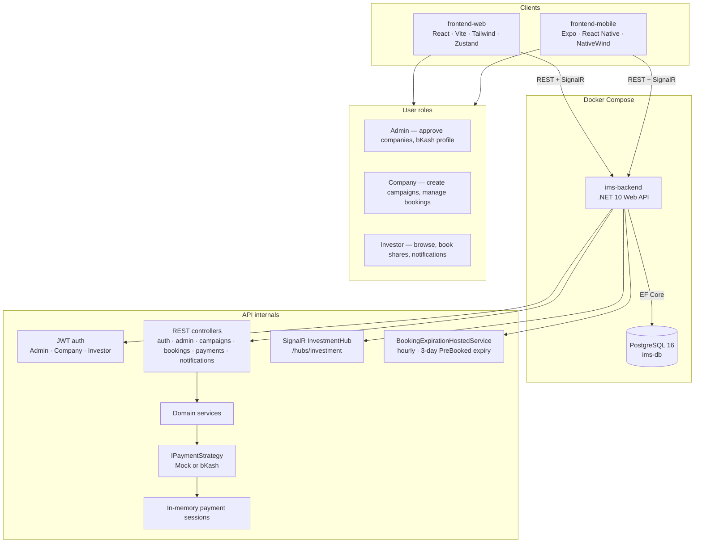
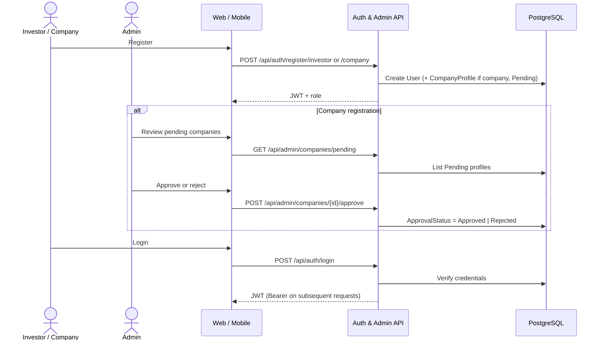
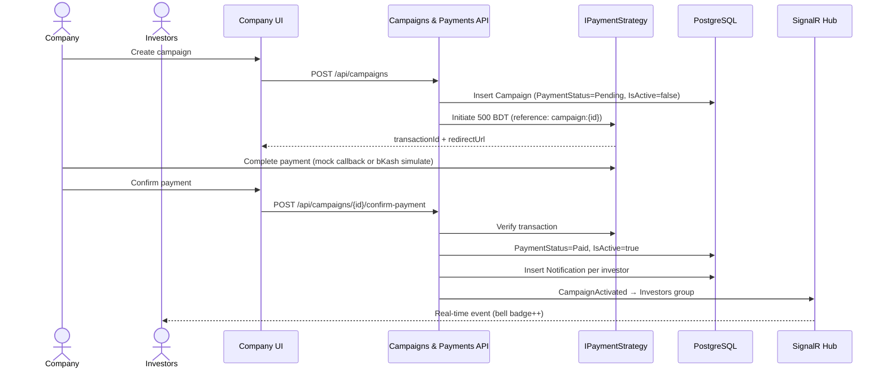
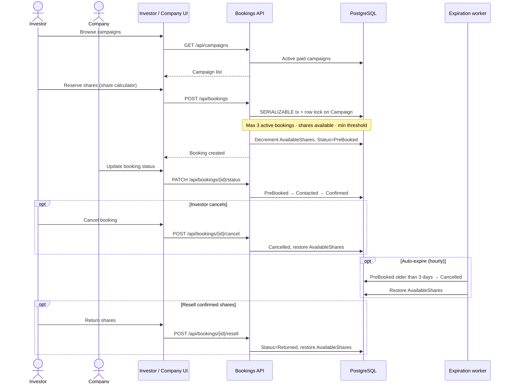
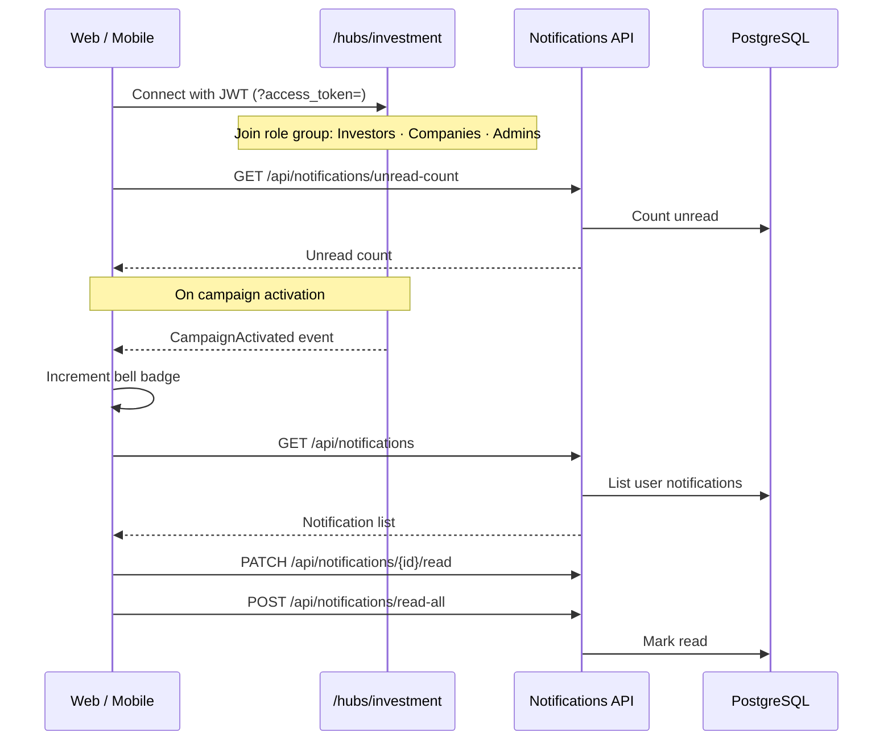

# Investment Management System

Phase 1–6 deliver the full stack: API, payments, bookings, SignalR, and web/mobile UIs.

## Prerequisites

- [Docker Desktop](https://www.docker.com/products/docker-desktop/) (Compose v2)
- Optional: [.NET 10 SDK](https://dotnet.microsoft.com/download) for local EF CLI and API development

## Quick start

1. Copy environment defaults:

   ```bash
   cp .env.example .env
   ```

   On Windows PowerShell:

   ```powershell
   Copy-Item .env.example .env
   ```

2. Start the stack:

   ```bash
   docker compose up --build
   ```

3. Open services:

   | Service | URL |
   |---------|-----|
   | Web (Vite) | http://localhost:3000 |
   | API | http://localhost:5000 |
   | API health | http://localhost:5000/health |
   | PostgreSQL | `localhost:5432` |

Migrations run automatically when the backend container starts.

## Seed admin account

| Field | Value |
|-------|--------|
| Email | `admin@investment.local` |
| Password | `Admin@12345` |
| Role | Admin |
| bKash number | `01700000000` |

Change these credentials before any production deployment.

## Verification

```bash
curl http://localhost:5000/health
curl http://localhost:3000
```

Confirm admin seed in PostgreSQL:

```bash
docker compose exec db psql -U ims_user -d investment_management -c "SELECT \"Email\", \"Role\" FROM \"Users\";"
```

List tables:

```bash
docker compose exec db psql -U ims_user -d investment_management -c "\dt"
```

Expected tables: `Users`, `CompanyProfiles`, `Campaigns`, `Bookings`, `__EFMigrationsHistory`.

## Project layout

```text
backend/                          # .NET 10 Web API
  InvestmentManagement.slnx
  src/InvestmentManagement.Api/   # EF Core entities, migrations, Dockerfile
frontend-web/                     # React + Vite (Phase 6 expands UI)
docker-compose.yml
.env.example
```

## Architecture & diagrams

### System architecture

End-to-end flow across clients, Docker services, and internal API components.



| Layer | Technology |
|-------|------------|
| Backend | .NET 10, EF Core 10, ASP.NET Core SignalR |
| Database | PostgreSQL 16 |
| Web | React 19, Vite, TailwindCSS, Zustand, React Router, `@microsoft/signalr` |
| Mobile | Expo, React Native, NativeWind, Zustand, React Navigation |
| Containers | Docker Compose (`db`, `backend`, `frontend-web`) |

### Entity-relationship diagram

Five persisted tables. Payment sessions are held in memory only (not in the database).

```mermaid
erDiagram
    User ||--o| CompanyProfile : "has when Company role"
    User ||--o{ Booking : "invests as Investor"
    CompanyProfile ||--o{ Campaign : "owns"
    Campaign ||--o{ Booking : "receives"
    User ||--o{ Notification : "receives"
    Campaign ||--o{ Notification : "optional reference"

    User {
        uuid Id PK
        string Email UK
        string PasswordHash
        enum Role "Admin | Company | Investor"
        string BKashNumber "nullable, admin receiving number"
    }

    CompanyProfile {
        uuid Id PK
        uuid UserId FK UK
        string DocumentationUrl
        enum ApprovalStatus "Pending | Approved | Rejected"
    }

    Campaign {
        uuid Id PK
        uuid CompanyId FK
        int TotalShares
        int AvailableShares
        decimal PricePerShare
        decimal MinInvestmentThreshold
        enum PaymentStatus "Pending | Paid"
        string BKashTransactionId "nullable"
        bool IsActive
    }

    Booking {
        uuid Id PK
        uuid InvestorId FK
        uuid CampaignId FK
        int ReservedShares
        decimal TotalPrice
        enum Status "PreBooked | Contacted | Confirmed | Cancelled | Returned"
        datetime CreatedAt
        datetime UpdatedAt
    }

    Notification {
        uuid Id PK
        uuid UserId FK
        uuid CampaignId FK "nullable"
        string Message
        bool IsRead
        datetime CreatedAt
    }
```

**Relationships**

| From | To | Cardinality | Notes |
|------|----|-------------|-------|
| User | CompanyProfile | 1:1 | Company role only; cascade delete |
| User | Booking | 1:N | Investor role |
| CompanyProfile | Campaign | 1:N | Company must be Approved to create |
| Campaign | Booking | 1:N | Shares deducted on PreBooked |
| User | Notification | 1:N | Cascade delete |
| Campaign | Notification | 1:N | Optional; set null on campaign delete |

**Booking status flow:** `PreBooked` → `Contacted` → `Confirmed` · `PreBooked`/`Contacted` → `Cancelled` · `Confirmed` → `Returned` (resell)

### Sequence diagrams

#### 1. Authentication and company onboarding



#### 2. Campaign creation, payment, and activation

Listing fee is **500 BDT**. Campaign stays inactive until payment is verified.



Payment mode is controlled by `FeatureManagement__UseMockPayment`: **mock** auto-verifies via callback; **bKash** uses the simulated checkout page and admin `BKashNumber`.

#### 3. Investor booking flow



#### 4. Notifications and SignalR



## Local EF migrations

From `backend/src/InvestmentManagement.Api`:

```bash
# Ensure PostgreSQL is running (e.g. docker compose up db)
$env:ConnectionStrings__DefaultConnection="Host=localhost;Port=5432;Database=investment_management;Username=ims_user;Password=ims_dev_password"

dotnet ef migrations add <MigrationName> --output-dir Migrations
dotnet ef database update
```

## Configuration

| Variable | Purpose |
|----------|---------|
| `ConnectionStrings__DefaultConnection` | PostgreSQL connection for the API |
| `FeatureManagement__UseMockPayment` | Reserved for Phase 3 payment bypass (`true` / `false`) |
| `VITE_API_BASE_URL` | Frontend API base URL (default `http://localhost:5000`) |

## Phase 6 — Web and mobile UI

### Web (`frontend-web`)
- **Stack:** React, Vite, TailwindCSS, Zustand, React Router, `@microsoft/signalr`
- **URL:** http://localhost:3000
- **Testing mode:** `VITE_IS_TESTING=true` shows `[DEBUG] Bypass Payment` on company payment flow

| Route | Role |
|-------|------|
| `/login`, `/register` | Public |
| `/investor` | Browse campaigns, share calculator, bookings, notification bell |
| `/company` | Create campaign (500 BDT), manage booking status |
| `/admin` | Approve companies, update bKash profile |

Local dev (without Docker): `cd frontend-web && npm install && npm run dev`

### Mobile (`frontend-mobile`)
- **Stack:** Expo, NativeWind, Zustand, React Navigation, `@microsoft/signalr`
- **Run:** `cd frontend-mobile && npm install && npm start`
- On a physical device, set `EXPO_PUBLIC_API_BASE_URL=http://<your-lan-ip>:5000`
- **Testing mode:** `EXPO_PUBLIC_IS_TESTING=true` enables debug payment bypass

Feature parity with web: auth, investor/company/admin screens, share calculator, SignalR unread badge, payment bypass in testing mode.

## Phase 5 API (notifications and SignalR)

| Method | Route | Auth |
|--------|-------|------|
| `GET` | `/api/notifications` | JWT |
| `GET` | `/api/notifications/unread-count` | JWT |
| `PATCH` | `/api/notifications/{id}/read` | JWT |
| `POST` | `/api/notifications/read-all` | JWT |

**Hub:** `ws/http://localhost:5000/hubs/investment?access_token=<jwt>`

When a company confirms campaign payment, all investors receive a DB notification and a real-time `CampaignActivated` event.

**Web UI:** `frontend-web` includes a notification bell — paste an investor JWT in the dev panel to connect.

## Phase 4 API (campaigns and bookings)

**Campaign listing fee:** 500 BDT (via payment flow from Phase 3).

| Method | Route | Auth |
|--------|-------|------|
| `GET` | `/api/campaigns` | Public |
| `POST` | `/api/campaigns` | Company (approved) |
| `POST` | `/api/campaigns/{id}/confirm-payment` | Company |
| `POST` | `/api/bookings` | Investor |
| `POST` | `/api/bookings/{id}/cancel` | Investor |
| `PATCH` | `/api/bookings/{id}/status` | Company (`Contacted` / `Confirmed`) |
| `POST` | `/api/bookings/{id}/resell` | Investor |

Booking rules: max 3 active (`PreBooked`/`Contacted`), serializable transaction + row lock, min investment threshold, 3-day auto-cancel worker.

## Phase 3 API (payments)

Controlled by `FeatureManagement__UseMockPayment` (`true` = mock, `false` = bKash simulator).

| Method | Route | Auth |
|--------|-------|------|
| `GET` | `/api/payments/mode` | Public |
| `POST` | `/api/payments/initiate` | JWT |
| `POST` | `/api/payments/verify` | JWT |
| `GET` | `/api/payments/callback` | Public (gateway redirect) |
| `GET` | `/api/payments/bkash/simulate` | Public (bKash mode) |

```bash
curl http://localhost:5000/api/payments/mode

curl -X POST http://localhost:5000/api/payments/initiate \
  -H "Authorization: Bearer <token>" \
  -H "Content-Type: application/json" \
  -d '{"amount":500,"description":"Campaign listing fee"}'
# Open redirectUrl in browser (mock auto-verifies via callback)

curl -X POST http://localhost:5000/api/payments/verify \
  -H "Authorization: Bearer <token>" \
  -H "Content-Type: application/json" \
  -d '{"transactionId":"<transactionId from initiate>"}'
```

## Phase 2 API (authentication)

| Method | Route | Auth |
|--------|-------|------|
| `POST` | `/api/auth/login` | Public |
| `POST` | `/api/auth/register/investor` | Public |
| `POST` | `/api/auth/register/company` | Public |
| `PUT` | `/api/admin/profile` | Admin JWT |
| `GET` | `/api/admin/companies/pending` | Admin JWT |
| `POST` | `/api/admin/companies/{id}/approve` | Admin JWT |

### Example: admin login

```bash
curl -X POST http://localhost:5000/api/auth/login \
  -H "Content-Type: application/json" \
  -d "{\"email\":\"admin@investment.local\",\"password\":\"Admin@12345\"}"
```

Use the returned `accessToken` as `Authorization: Bearer <token>` on admin routes.

### Example: register company and approve

```bash
# Register company (returns token; profile is Pending)
curl -X POST http://localhost:5000/api/auth/register/company \
  -H "Content-Type: application/json" \
  -d "{\"email\":\"company@example.com\",\"password\":\"Company@123\",\"documentationUrl\":\"https://example.com/docs.pdf\"}"

# List pending (admin token)
curl http://localhost:5000/api/admin/companies/pending \
  -H "Authorization: Bearer <admin_token>"

# Approve
curl -X POST http://localhost:5000/api/admin/companies/<companyProfileId>/approve \
  -H "Authorization: Bearer <admin_token>" \
  -H "Content-Type: application/json" \
  -d "{\"approve\":true}"
```

## Master plan

See [MASTER_PLAN.md](MASTER_PLAN.md) for the full phased blueprint (Phases 1–6).

## Phase roadmap

- **Phase 1** (complete): Docker, schema, admin seed
- **Phase 2** (complete): JWT auth, registration, admin endpoints
- **Phase 3** (complete): Payment strategy (bKash / mock)
- **Phase 4** (complete): Campaigns, bookings, concurrency, background jobs
- **Phase 5** (complete): SignalR notifications
- **Phase 6** (complete): Full web + mobile UI
