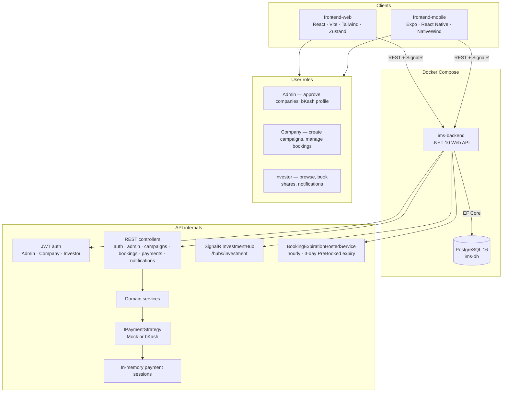
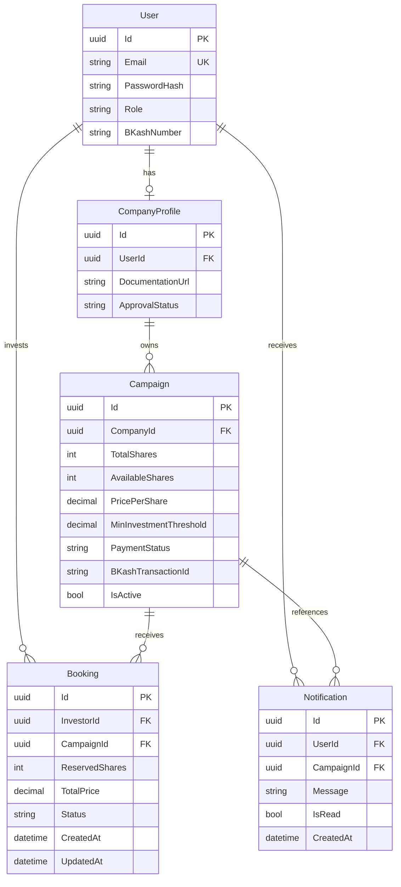
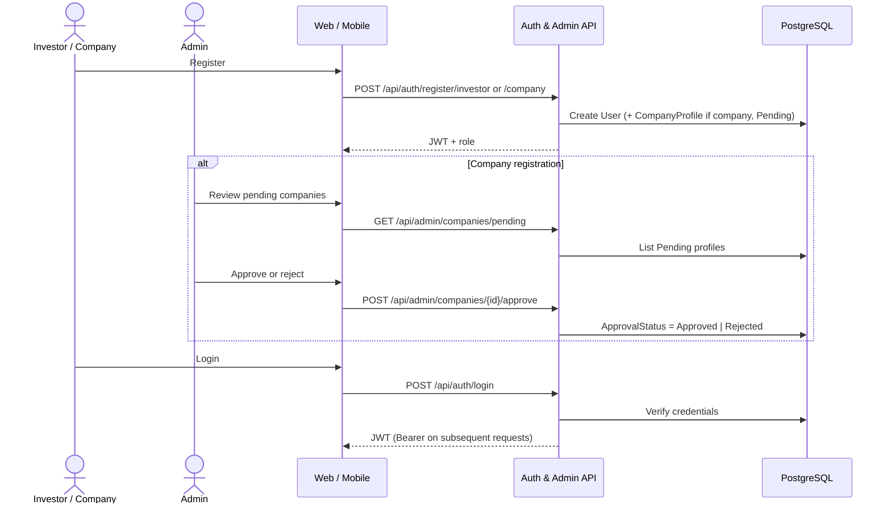
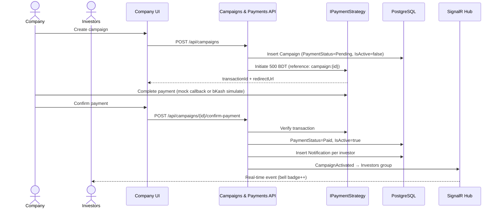
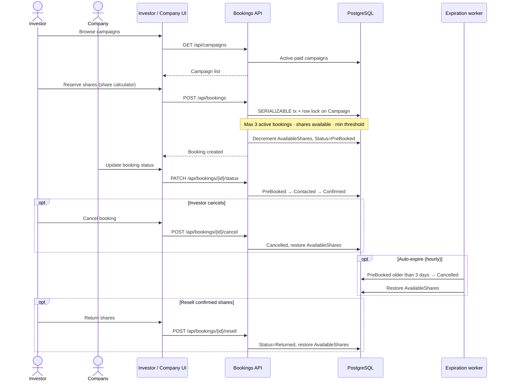
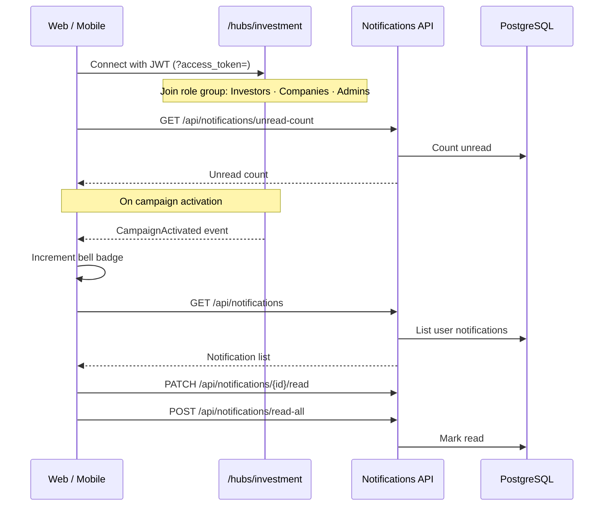

# Investment Management System

Phase 1–6 deliver the full stack: API, payments, bookings, SignalR, and web/mobile UIs.

## Prerequisites

- [Docker Desktop](https://www.docker.com/products/docker-desktop/) (Compose v2)
- Optional: [.NET 10 SDK](https://dotnet.microsoft.com/download) for local EF CLI and API development

## Quick start

1. Copy environment defaults:

   ```bash
   cp .env.example .env
   ```

   On Windows PowerShell:

   ```powershell
   Copy-Item .env.example .env
   ```

2. Start the stack:

   ```bash
   docker compose up --build
   ```

3. Open services:

   | Service | URL |
   |---------|-----|
   | Web (Vite) | http://localhost:3000 |
   | API | http://localhost:5000 |
   | API health | http://localhost:5000/health |
   | PostgreSQL | `localhost:5432` |

Migrations run automatically when the backend container starts.

## Seed admin account

| Field | Value |
|-------|--------|
| Email | `admin@investment.local` |
| Password | `Admin@12345` |
| Role | Admin |
| bKash number | `01700000000` |

Change these credentials before any production deployment.

## Verification

```bash
curl http://localhost:5000/health
curl http://localhost:3000
```

Confirm admin seed in PostgreSQL:

```bash
docker compose exec db psql -U ims_user -d investment_management -c "SELECT \"Email\", \"Role\" FROM \"Users\";"
```

List tables:

```bash
docker compose exec db psql -U ims_user -d investment_management -c "\dt"
```

Expected tables: `Users`, `CompanyProfiles`, `Campaigns`, `Bookings`, `__EFMigrationsHistory`.

## Project layout

```text
backend/                          # .NET 10 Web API
  InvestmentManagement.slnx
  src/InvestmentManagement.Api/   # EF Core entities, migrations, Dockerfile
frontend-web/                     # React + Vite (Phase 6 expands UI)
docker-compose.yml
.env.example
```

## Architecture & diagrams

### System architecture

End-to-end flow across clients, Docker services, and internal API components.



| Layer | Technology |
|-------|------------|
| Backend | .NET 10, EF Core 10, ASP.NET Core SignalR |
| Database | PostgreSQL 16 |
| Web | React 19, Vite, TailwindCSS, Zustand, React Router, `@microsoft/signalr` |
| Mobile | Expo, React Native, NativeWind, Zustand, React Navigation |
| Containers | Docker Compose (`db`, `backend`, `frontend-web`) |

### Entity-relationship diagram

Five persisted tables. Payment sessions are held in memory only (not in the database).



**Relationships**

| From | To | Cardinality | Notes |
|------|----|-------------|-------|
| User | CompanyProfile | 1:1 | Company role only; cascade delete |
| User | Booking | 1:N | Investor role |
| CompanyProfile | Campaign | 1:N | Company must be Approved to create |
| Campaign | Booking | 1:N | Shares deducted on PreBooked |
| User | Notification | 1:N | Cascade delete |
| Campaign | Notification | 1:N | Optional; set null on campaign delete |

**Enum fields (stored as strings):** `User.Role` — Admin, Company, Investor · `CompanyProfile.ApprovalStatus` — Pending, Approved, Rejected · `Campaign.PaymentStatus` — Pending, Paid · `Booking.Status` — PreBooked, Contacted, Confirmed, Cancelled, Returned

**Nullable fields:** `User.BKashNumber`, `Campaign.BKashTransactionId`, `Notification.CampaignId` · `CompanyProfile.UserId` is unique (1:1 with User)

**Booking status flow:** `PreBooked` → `Contacted` → `Confirmed` · `PreBooked`/`Contacted` → `Cancelled` · `Confirmed` → `Returned` (resell)

### Sequence diagrams

#### 1. Authentication and company onboarding



#### 2. Campaign creation, payment, and activation

Listing fee is **500 BDT**. Campaign stays inactive until payment is verified.



Payment mode is controlled by `FeatureManagement__UseMockPayment`: **mock** auto-verifies via callback; **bKash** uses the simulated checkout page and admin `BKashNumber`.

#### 3. Investor booking flow



#### 4. Notifications and SignalR



## Local EF migrations

From `backend/src/InvestmentManagement.Api`:

```bash
# Ensure PostgreSQL is running (e.g. docker compose up db)
$env:ConnectionStrings__DefaultConnection="Host=localhost;Port=5432;Database=investment_management;Username=ims_user;Password=ims_dev_password"

dotnet ef migrations add <MigrationName> --output-dir Migrations
dotnet ef database update
```

## Configuration

| Variable | Purpose |
|----------|---------|
| `ConnectionStrings__DefaultConnection` | PostgreSQL connection for the API |
| `FeatureManagement__UseMockPayment` | Reserved for Phase 3 payment bypass (`true` / `false`) |
| `VITE_API_BASE_URL` | Frontend API base URL (default `http://localhost:5000`) |

## Phase 6 — Web and mobile UI

### Web (`frontend-web`)
- **Stack:** React, Vite, TailwindCSS, Zustand, React Router, `@microsoft/signalr`
- **URL:** http://localhost:3000
- **Testing mode:** `VITE_IS_TESTING=true` shows `[DEBUG] Bypass Payment` on company payment flow

| Route | Role |
|-------|------|
| `/login`, `/register` | Public |
| `/investor` | Browse campaigns, share calculator, bookings, notification bell |
| `/company` | Create campaign (500 BDT), manage booking status |
| `/admin` | Approve companies, update bKash profile |

Local dev (without Docker): `cd frontend-web && npm install && npm run dev`

### Mobile (`frontend-mobile`)
- **Stack:** Expo, NativeWind, Zustand, React Navigation, `@microsoft/signalr`
- **Run:** `cd frontend-mobile && npm install && npm start`
- On a physical device, set `EXPO_PUBLIC_API_BASE_URL=http://<your-lan-ip>:5000`
- **Testing mode:** `EXPO_PUBLIC_IS_TESTING=true` enables debug payment bypass

Feature parity with web: auth, investor/company/admin screens, share calculator, SignalR unread badge, payment bypass in testing mode.

## Phase 5 API (notifications and SignalR)

| Method | Route | Auth |
|--------|-------|------|
| `GET` | `/api/notifications` | JWT |
| `GET` | `/api/notifications/unread-count` | JWT |
| `PATCH` | `/api/notifications/{id}/read` | JWT |
| `POST` | `/api/notifications/read-all` | JWT |

**Hub:** `ws/http://localhost:5000/hubs/investment?access_token=<jwt>`

When a company confirms campaign payment, all investors receive a DB notification and a real-time `CampaignActivated` event.

**Web UI:** `frontend-web` includes a notification bell — paste an investor JWT in the dev panel to connect.

## Phase 4 API (campaigns and bookings)

**Campaign listing fee:** 500 BDT (via payment flow from Phase 3).

| Method | Route | Auth |
|--------|-------|------|
| `GET` | `/api/campaigns` | Public |
| `POST` | `/api/campaigns` | Company (approved) |
| `POST` | `/api/campaigns/{id}/confirm-payment` | Company |
| `POST` | `/api/bookings` | Investor |
| `POST` | `/api/bookings/{id}/cancel` | Investor |
| `PATCH` | `/api/bookings/{id}/status` | Company (`Contacted` / `Confirmed`) |
| `POST` | `/api/bookings/{id}/resell` | Investor |

Booking rules: max 3 active (`PreBooked`/`Contacted`), serializable transaction + row lock, min investment threshold, 3-day auto-cancel worker.

## Phase 3 API (payments)

Controlled by `FeatureManagement__UseMockPayment` (`true` = mock, `false` = bKash simulator).

| Method | Route | Auth |
|--------|-------|------|
| `GET` | `/api/payments/mode` | Public |
| `POST` | `/api/payments/initiate` | JWT |
| `POST` | `/api/payments/verify` | JWT |
| `GET` | `/api/payments/callback` | Public (gateway redirect) |
| `GET` | `/api/payments/bkash/simulate` | Public (bKash mode) |

```bash
curl http://localhost:5000/api/payments/mode

curl -X POST http://localhost:5000/api/payments/initiate \
  -H "Authorization: Bearer <token>" \
  -H "Content-Type: application/json" \
  -d '{"amount":500,"description":"Campaign listing fee"}'
# Open redirectUrl in browser (mock auto-verifies via callback)

curl -X POST http://localhost:5000/api/payments/verify \
  -H "Authorization: Bearer <token>" \
  -H "Content-Type: application/json" \
  -d '{"transactionId":"<transactionId from initiate>"}'
```

## Phase 2 API (authentication)

| Method | Route | Auth |
|--------|-------|------|
| `POST` | `/api/auth/login` | Public |
| `POST` | `/api/auth/register/investor` | Public |
| `POST` | `/api/auth/register/company` | Public |
| `PUT` | `/api/admin/profile` | Admin JWT |
| `GET` | `/api/admin/companies/pending` | Admin JWT |
| `POST` | `/api/admin/companies/{id}/approve` | Admin JWT |

### Example: admin login

```bash
curl -X POST http://localhost:5000/api/auth/login \
  -H "Content-Type: application/json" \
  -d "{\"email\":\"admin@investment.local\",\"password\":\"Admin@12345\"}"
```

Use the returned `accessToken` as `Authorization: Bearer <token>` on admin routes.

### Example: register company and approve

```bash
# Register company (returns token; profile is Pending)
curl -X POST http://localhost:5000/api/auth/register/company \
  -H "Content-Type: application/json" \
  -d "{\"email\":\"company@example.com\",\"password\":\"Company@123\",\"documentationUrl\":\"https://example.com/docs.pdf\"}"

# List pending (admin token)
curl http://localhost:5000/api/admin/companies/pending \
  -H "Authorization: Bearer <admin_token>"

# Approve
curl -X POST http://localhost:5000/api/admin/companies/<companyProfileId>/approve \
  -H "Authorization: Bearer <admin_token>" \
  -H "Content-Type: application/json" \
  -d "{\"approve\":true}"
```

## Manual test cases

Use these cases to verify Admin, Investor, and Company flows on the running stack (`docker compose up --build`).

### Before you start

| Item | Value |
|------|--------|
| Web UI | http://localhost:3000 |
| API | http://localhost:5000 |
| Payment mode | Mock (`FeatureManagement__UseMockPayment=true` in `.env`) |
| Debug payment bypass | Enabled (`VITE_IS_TESTING=true`) — gray **[DEBUG] Bypass Payment** button on company payment panel |

**Health check**

```bash
curl http://localhost:5000/health
# Expected: {"status":"healthy"}
```

### Suggested test accounts

Create these via the UI at http://localhost:3000/register (or use the seeded admin).

| Role | Email | Password | Notes |
|------|-------|----------|-------|
| Admin | `admin@investment.local` | `Admin@12345` | Seeded on first startup |
| Company | `company@test.local` | `Company@123` | Register as Company; needs admin approval |
| Investor | `investor@test.local` | `Investor@123` | Register as Investor; active immediately |

Use a **private/incognito window** (or log out) when switching roles so JWT state does not mix.

### Recommended end-to-end order

Run this once to exercise all three roles together:

1. **Company** — Register `company@test.local` → lands on `/company`
2. **Admin** — Log in → Approve the pending company
3. **Company** — Log in → Create campaign → pay 500 BDT listing fee → campaign becomes active
4. **Investor** — Register `investor@test.local` → book shares on the active campaign
5. **Company** — Mark booking **Contacted** → **Confirmed**
6. **Investor** — Optionally cancel a PreBooked booking, or **Return shares (resell)** on a Confirmed booking
7. **Investor** — After step 3, check the red notification badge in the header (campaign activated)

---

### 1. Admin test cases

Route: http://localhost:3000/admin

| ID | Test case | Steps | Expected result |
|----|-----------|-------|-----------------|
| ADM-01 | Login as admin | 1. Open `/login`<br>2. Email `admin@investment.local`, password `Admin@12345`<br>3. Click **Sign in** | Redirect to `/admin`. Header shows `admin@investment.local (Admin)` |
| ADM-02 | Invalid login | 1. `/login` with wrong password | Error: invalid email or password. Stay on login page |
| ADM-03 | View pending companies | 1. Log in as admin<br>2. Scroll to **Pending companies** | Companies with `ApprovalStatus = Pending` are listed with email and **Docs** link |
| ADM-04 | Approve company | 1. With `company@test.local` registered and pending<br>2. Click **Approve** on that row | Green message: `Company approved.` Company disappears from pending list |
| ADM-05 | Reject company | 1. Register another company (e.g. `reject@test.local`)<br>2. As admin, click **Reject** | Message: `Company rejected.` Company removed from pending list |
| ADM-06 | Update system profile | 1. **System profile** section<br>2. Set email, optional new password, bKash number (e.g. `01712345678`)<br>3. Click **Save** | Message: `Admin profile updated.` Subsequent logins use new email/password if changed |
| ADM-07 | Role protection | 1. Log in as Investor or Company<br>2. Manually open `/admin` | Redirect to `/login` (non-admin blocked) |
| ADM-08 | Approve already processed company (API) | `POST /api/admin/companies/{id}/approve` twice for same company | Second call: `400` — company profile is not pending approval |

**Admin API spot-check**

```bash
# Login and save token
curl -s -X POST http://localhost:5000/api/auth/login \
  -H "Content-Type: application/json" \
  -d '{"email":"admin@investment.local","password":"Admin@12345"}'

# List pending (replace TOKEN)
curl http://localhost:5000/api/admin/companies/pending \
  -H "Authorization: Bearer TOKEN"
```

---

### 2. Investor test cases

Routes: http://localhost:3000/register · http://localhost:3000/investor

| ID | Test case | Steps | Expected result |
|----|-----------|-------|-----------------|
| INV-01 | Register investor | 1. `/register` → select **Investor**<br>2. Email `investor@test.local`, password `Investor@123` (min 8 chars)<br>3. **Register** | Redirect to `/investor`. Account active immediately |
| INV-02 | Login as investor | 1. `/login` with investor credentials | Redirect to `/investor` |
| INV-03 | Browse active campaigns | 1. Log in as investor<br>2. View **Active campaigns** | Only campaigns with paid listing fee and `IsActive = true` appear. Each card shows available/total shares, price/share, min investment |
| INV-04 | Book shares (happy path) | 1. Click a campaign card<br>2. In **Share calculator**, set shares so total ≥ min threshold (e.g. 10 shares × 50 BDT = 500 BDT)<br>3. Click **Book shares** | Message: `Booking created (PreBooked).` Booking listed under **My bookings** with status `PreBooked`. Campaign available shares decrease |
| INV-05 | Below minimum threshold | 1. Select campaign with min 500 BDT, price 50/share<br>2. Set shares to 5 (total 250 BDT) | **Book shares** disabled. Red text: total below minimum investment threshold |
| INV-06 | Cancel booking | 1. On a `PreBooked` or `Contacted` booking<br>2. Click **Cancel / free** | Booking status becomes `Cancelled`. Campaign available shares restored |
| INV-07 | Resell confirmed shares | 1. Company confirms booking (`Confirmed`)<br>2. Investor clicks **Return shares (resell)** | Status becomes `Returned`. Shares return to campaign pool |
| INV-08 | Max 3 active bookings | 1. Create 3 bookings in `PreBooked` or `Contacted` on different campaigns<br>2. Try a 4th booking | Error: at most 3 active bookings |
| INV-09 | Exceed available shares | 1. Select campaign with few shares left<br>2. Try to book more than `availableShares` | Calculator caps at max; API rejects if shares exceed available |
| INV-10 | Campaign activation notification | 1. Log in as investor (keep tab open)<br>2. In another window, company activates a new campaign | Red badge in header increments. (SignalR `CampaignActivated` + unread count) |
| INV-11 | Role protection | 1. Log in as investor<br>2. Open `/company` or `/admin` | Redirect to `/login` |
| INV-12 | No campaigns before company pays | 1. Fresh DB; no paid campaigns | **Active campaigns** section is empty |

**Share calculator example** (default company campaign: 100 shares, 50 BDT/share, min 500 BDT):

| Shares | Total (BDT) | Can book? |
|--------|-------------|-----------|
| 5 | 250 | No (below min) |
| 10 | 500 | Yes |
| 20 | 1000 | Yes |

---

### 3. Company test cases

Routes: http://localhost:3000/register · http://localhost:3000/company

| ID | Test case | Steps | Expected result |
|----|-----------|-------|-----------------|
| COM-01 | Register company | 1. `/register` → **Company**<br>2. Email `company@test.local`, password `Company@123`, documentation URL<br>3. **Register** | Redirect to `/company`. Profile status is **Pending** until admin approves |
| COM-02 | Create campaign before approval | 1. Register company, do **not** get admin approval<br>2. Fill campaign form → **Create & pay listing fee** | Error: company must be approved before creating campaigns |
| COM-03 | Create campaign (happy path) | 1. Admin approves company<br>2. Log in as company<br>3. Defaults: 100 shares, 50 BDT/share, min 500 BDT<br>4. **Create & pay listing fee** | Message: campaign created. Payment panel appears (500 BDT) |
| COM-04 | Pay listing fee (mock + bypass) | 1. After COM-03, payment panel visible<br>2. Click **[DEBUG] Bypass Payment** (or **Open payment gateway** then return)<br>3. Complete verify flow | Message: `Campaign is now active.` Campaign visible to investors on `/investor` |
| COM-05 | Pay listing fee (gateway redirect) | 1. Click **Open payment gateway**<br>2. Mock callback auto-verifies → redirect to `/payment/success` | Payment success page. Return to company tab and confirm campaign active if needed |
| COM-06 | Mark booking contacted | 1. Investor has `PreBooked` booking on your campaign<br>2. **Bookings on your campaigns** → **Mark contacted** | Booking status `Contacted` |
| COM-07 | Confirm booking | 1. On `Contacted` booking → **Confirm** | Status `Confirmed` |
| COM-08 | Invalid status jump | 1. Try API `PATCH /api/bookings/{id}/status` with `Confirmed` on a `PreBooked` booking | `400` — cannot transition from PreBooked to Confirmed (must go through Contacted) |
| COM-09 | View company bookings | 1. Log in as company with active campaign and bookings | **Bookings on your campaigns** lists all bookings with shares, total BDT, status |
| COM-10 | Role protection | 1. Log in as company<br>2. Open `/admin` or `/investor` | Redirect to `/login` |
| COM-11 | Rejected company | 1. Admin rejects company<br>2. Company tries to create campaign | Error: company must be approved |

**Campaign form defaults (UI)**

| Field | Default | Meaning |
|-------|---------|---------|
| Total shares | 100 | Share pool for the campaign |
| Price/share | 50 BDT | Price per share |
| Min investment | 500 BDT | Minimum order = shares × price |
| Listing fee | 500 BDT (fixed) | Required to activate campaign |

---

### 4. Cross-role integration checklist

Use this checklist after running the end-to-end order above:

| # | Action | Role | Pass? |
|---|--------|------|-------|
| 1 | Company registers and appears in admin pending list | Company → Admin | ☐ |
| 2 | Admin approves company | Admin | ☐ |
| 3 | Company creates campaign and pays 500 BDT fee | Company | ☐ |
| 4 | Campaign appears on investor dashboard | Investor | ☐ |
| 5 | Investor receives notification badge on activation | Investor | ☐ |
| 6 | Investor books shares (`PreBooked`) | Investor | ☐ |
| 7 | Company marks `Contacted` then `Confirmed` | Company | ☐ |
| 8 | Investor cancels a `PreBooked` booking (shares restored) | Investor | ☐ |
| 9 | Investor resells a `Confirmed` booking (`Returned`) | Investor | ☐ |
| 10 | Logout works and protected routes require login | Any | ☐ |

### 5. Reset test data (optional)

To start fresh:

```bash
docker compose down -v
docker compose up --build
```

This recreates PostgreSQL and re-seeds the admin account. Re-register company and investor accounts.

### 6. Verify data in PostgreSQL (optional)

```bash
# Users and roles
docker compose exec db psql -U ims_user -d investment_management \
  -c "SELECT \"Email\", \"Role\" FROM \"Users\";"

# Company approval status
docker compose exec db psql -U ims_user -d investment_management \
  -c "SELECT u.\"Email\", cp.\"ApprovalStatus\" FROM \"CompanyProfiles\" cp JOIN \"Users\" u ON u.\"Id\" = cp.\"UserId\";"

# Active campaigns and bookings
docker compose exec db psql -U ims_user -d investment_management \
  -c "SELECT \"Id\", \"IsActive\", \"PaymentStatus\", \"AvailableShares\" FROM \"Campaigns\";"

docker compose exec db psql -U ims_user -d investment_management \
  -c "SELECT \"Status\", \"ReservedShares\", \"TotalPrice\" FROM \"Bookings\";"
```

---

## Master plan

See [MASTER_PLAN.md](MASTER_PLAN.md) for the full phased blueprint (Phases 1–6).

## Phase roadmap

- **Phase 1** (complete): Docker, schema, admin seed
- **Phase 2** (complete): JWT auth, registration, admin endpoints
- **Phase 3** (complete): Payment strategy (bKash / mock)
- **Phase 4** (complete): Campaigns, bookings, concurrency, background jobs
- **Phase 5** (complete): SignalR notifications
- **Phase 6** (complete): Full web + mobile UI
